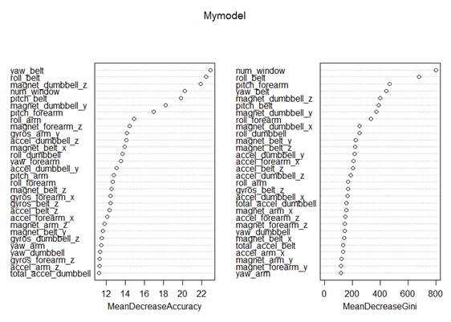

Practical Machine Learning

Assignment: Prediction Assignment Write-up

The data has been downloaded from the links presented in the assignment. I load the data and then take a close look at the data and the classes’ field, denoting the miscellaneous NA, \#DIV/0!, and empty fields as NA.

**R commands:**

```R
setwd("D:/PML")

Mytrainingset <- read.csv("pml-training.csv", na.strings = c("NA", "\#DIV/0!", ""))

Mytestingset <- read.csv("pml-testing.csv", na.strings = c("NA", "\#DIV/0!", ""))

str(Mytrainingset, list.len=18)
```
 
 

**Outputs:**

```
data.frame: 19622 obs. of 160 variables:

$ X : int 1 2 3 4 5 6 7 8 9 10 ...

$ user_name : Factor w/ 6 levels "adelmo","carlitos",..: 2 2 2 2 2 2 2 2 2 2 ...

$ raw_timestamp_part_1 : int 1323084231 1323084231 1323084231 1323084232 1323084232 1323084232 1323084232 1323084232 1323084232 1323084232 ...

$ raw_timestamp_part_2 : int 788290 808298 820366 120339 196328 304277 368296 440390 484323 484434 ...

$ cvtd_timestamp : Factor w/ 20 levels "02/12/2011 13:32",..: 9 9 9 9 9 9 9 9 9 9 ...

$ new_window : Factor w/ 2 levels "no","yes": 1 1 1 1 1 1 1 1 1 1 ...

$ num_window : int 11 11 11 12 12 12 12 12 12 12 ...

$ roll_belt : num 1.41 1.41 1.42 1.48 1.48 1.45 1.42 1.42 1.43 1.45 ...

$ pitch_belt : num 8.07 8.07 8.07 8.05 8.07 8.06 8.09 8.13 8.16 8.17 ...

$ yaw_belt : num -94.4 -94.4 -94.4 -94.4 -94.4 -94.4 -94.4 -94.4 -94.4 -94.4 ...

$ total_accel_belt : int 3 3 3 3 3 3 3 3 3 3 ...

$ kurtosis_roll_belt : num NA NA NA NA NA NA NA NA NA NA ...

$ kurtosis_picth_belt : num NA NA NA NA NA NA NA NA NA NA ...

$ kurtosis_yaw_belt : logi NA NA NA NA NA NA ...

$ skewness_roll_belt : num NA NA NA NA NA NA NA NA NA NA ...

$ skewness_roll_belt.1 : num NA NA NA NA NA NA NA NA NA NA ...

$ skewness_yaw_belt : logi NA NA NA NA NA NA ...

$ max_roll_belt : num NA NA NA NA NA NA NA NA NA NA ...

[list output truncated]
```
 

**R commands:**

```R
table(Mytrainingset$classe)

prop.table(table(Mytrainingset$user_name, training$classe), 1)

prop.table(table(Mytrainingset$classe))
```

**Outputs:**

```
A B C D E

5580 3797 3422 3216 3607

adelmo 0.2993320 0.1993834 0.1927030 0.1323227 0.1762590

carlitos 0.2679949 0.2217224 0.1584190 0.1561697 0.1956941

charles 0.2542421 0.2106900 0.1524321 0.1815611 0.2010747

eurico 0.2817590 0.1928339 0.1592834 0.1895765 0.1765472

jeremy 0.3459730 0.1437390 0.1916520 0.1534392 0.1651969

pedro 0.2452107 0.1934866 0.1911877 0.1796935 0.1904215

A B C D E

0.2843747 0.1935073 0.1743961 0.1638977 0.1838243
```

I am going to perform data clean-up by removing columns 1 to 6, which are only for reference purposes. I also need to delete columns that are NA.

Before I can go further with the data analysis tasks, I am going to split the training set into two set for the purpose of cross validation. I am going to randomly subsample **60% of the dataset for training** and **40% for testing**. These sections will be then used for evaluation and accuracy measurement.

**R commands:**

```R
trainingset <- Mytrainingset[, 7:160]

testingset <- Mytestingset[, 7:160]

is_data <- apply(!is.na(trainingset), 2, sum) > 19621

trainingset <- trainingset[, is_data]

testingset <- testingset[, is_data]

library(caret)

set.seed(3141592)

train <- createDataPartition(y=trainingset$classe, p=0.60, list=FALSE)

trainf <- trainingset[train,]

trains <- trainingset[-train,]

dim(trainf)

dim(trains)
```

**Outputs**:
```
[1] 11776 54

[1] 7846 54
```

The ***trainf*** has been the training set which includes 11776 observations, and ***trains*** has been the testing set that includes 7846 observations The ***trains*** would be utilized for accuracy measurements.

**R Commands:**

```R

nzv_cols <- nearZeroVar(trainf)

if(length(nzv_cols) > 0) {

trainf <- trainf[, -nzv_cols]
trains <- trains[, -nzv_cols]

}

dim(trainf)
```

**Outputs**:

```

[1] 11776 54

[1] 7846 54
```

**R Commands:**

```R
library(randomForest)

set.seed(3141592)

Mymodel <- randomForest(classe~., data=trainf, importance=TRUE, ntree=100)

varImpPlot(Mymodel)
```

**Outputs:**



**R Commands:**

```R

crl = cor(trainf[,c("yaw_belt","roll_belt","num_window","pitch_belt","magnet_dumbbell_z","magnet_dumbbell_y","pitch_forearm","accel_dumbbell_y","roll_arm","roll_forearm")])

diag(crl) <- 0

which(abs(crl)>0.75, arr.ind=TRUE)

cor(trainf$roll_belt, trainf$yaw_belt)

qplot(roll_belt, magnet_dumbbell_y, colour=classe, data=trainf)
```


**Outputs:**


```
row col

roll_belt 2 1

yaw_belt 1 2

[1] 0.8152349
```


**R Commands:**

```R

library(rpart.plot)

Mymodel <- rpart(classe~., data=trainf, method="class")

prp(Mymodel)
```

**Output:**

I am going to make the model now and measure the accuracy of the prediction model.

**R Commands:**

```R

set.seed(3141592)

Mymodel <- randomForest(classe~., data=trainf, importance=TRUE, ntree=100)

varImpPlot(Mymodel)

crl = cor(trainf[,c("yaw_belt","roll_belt","num_window","pitch_belt","magnet_dumbbell_z","magnet_dumbbell_y","pitch_forearm","accel_dumbbell_y","roll_arm","roll_forearm")])

diag(crl) <- 0

which(abs(crl)>0.75, arr.ind=TRUE)

cor(trainf$roll_belt, trainf$yaw_belt)

qplot(roll_belt, magnet_dumbbell_y, colour=classe, data=trainf)

set.seed(3141592)

Mymodel <- train(classe~roll_belt+num_window+pitch_belt+magnet_dumbbell_y+magnet_dumbbell_z+pitch_forearm+accel_dumbbell_y+roll_arm+roll_forearm,data=trainf, method="rf", trControl=trainControl(method="cv",number=2), prox=TRUE, verbose=TRUE, allowParallel=TRUE)

saveRDS(Mymodel, "predictionmodel.Rds")

Model <- readRDS("predictionmodel.Rds")

predictions <- predict(Model, newdata=trains)

confusionMat <- confusionMatrix(predictions, trains$classe)

confusionMat

missClass = function(values, predicted) {

sum(predicted != values) / length(values)

}

outS_errorRate = missClass(trains$classe, predictions)

outS_errorRate
```

**Outputs:**
```

Confusion Matrix and Statistics

Reference

Prediction A B C D E

A 2231 2 0 0 0

B 1 1512 0 0 1

C 0 3 1368 6 1

D 0 1 0 1280 3

E 0 0 0 0 1437

Overall Statistics

Accuracy : 0.9977

95% CI : (0.9964, 0.9986)

No Information Rate : 0.2845

P-Value [Acc > NIR] : < 2.2e-16

Kappa : 0.9971

Mcnemars Test P-Value : NA

Statistics by Class:

Class: A Class: B Class: C Class: D Class: E

Sensitivity 0.9996 0.9960 1.0000 0.9953 0.9965

Specificity 0.9996 0.9997 0.9985 0.9994 1.0000

Pos Pred Value 0.9991 0.9987 0.9927 0.9969 1.0000

Neg Pred Value 0.9998 0.9991 1.0000 0.9991 0.9992

Prevalence 0.2845 0.1935 0.1744 0.1639 0.1838

Detection Rate 0.2843 0.1927 0.1744 0.1631 0.1832

Detection Prevalence 0.2846 0.1930 0.1756 0.1637 0.1832

Balanced Accuracy 0.9996 0.9979 0.9992 0.9974 0.9983

[1] 0.002294163
```

As you can see, I got **99.77% accuracy**. The **out-of-sample error** **rate** has been **0.229%**.

The assignment has been very useful to me in the sense of practical machine learning techniques, and it helped much to investigate machine learning algorithms and strategies using R programming language.
